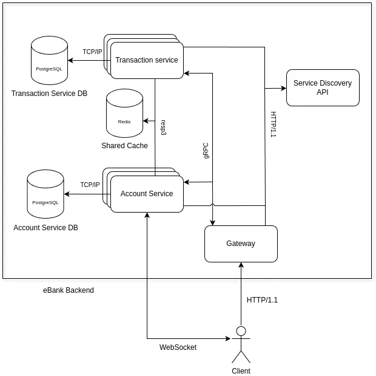

# eBank
### PAD Project by Dobrojan Alexandru FAF-212


## Description
eBank is a simple online banking platform, emphasizing on scalability and performance using modern approaches, namely microservice architecture, caching, 
architectural patterns like circuit breaker, gateway, service discovery, load balancing, health monitoring, status endpoints, rate limiting.
The platform provides the functionality to have an account, with a credit card bound to it, with an amount of currency, transfers from one account to another, and
expense tracking, providing data about the expenses on monthly and yearly basis.


## Details
### Why microservices
Banking is a critical component of any society, and is tightly involved in any kind of business activities and money flow. It is extremely important to be reliable,
fault-tolerant and fast. If it had a classic monolithic architecture, the entire system would risk shutting down, and create major problems in economy as well at global level
as per person. If a microservice falls otherwise, it can either be quickly restarted, or be disconnected and let other instances of the same service seamlessly handle the request (load balancing). 
Also, the critically loaded services can be horizontally scaled, ensuring performance and thus reliability of the whole system. Also, microservices allow separate teams to
develop some functionality, allowing more efficient how improvements and adding new features to the solution.

### Similar projects 
All major banking systems are using microservice architecture. It is impossible to provide a concrete example because the systems are closed-source and information about the system
architecture is not public. The majority of information about banking systems are provided by domain workers.

### Service boundaries
  - Account service - handling the user accounts and the associated credit cards. Has the functionality to create an account, login, insert/check balance details, exchange one currency to another within a card,
check if the transaction is possible or not (check the presence of required balance, for example).
  - Transaction service - handles everything related to transactions. A basic transaction is a transfer of an amount of currency from one card to another. It also stores the history of transactions in order to generate
statistics.

The two microservices provide enough functionality to support user authentication, having balance on their online card and transferring from one card to another and make payments.



### Technology stack
  - Account service - JavaScript/NestJS framework
  - Transaction service - C#/ASP.NET framework
  - Account service database - PostgreSQL
  - Transaction service database - PostgreSQL
  - Caching database - Redis
  - Gateway - Python 3/Flask framework
  - Unit testing - Jest for JavaScript, xUnit for C#, unittest for python
  - Load balancing - C#/ASP.NET framework
  - Service discovery - Python 3/Flask framework

### Communication patterns
Microservices are communicating via gRPC, a high-performance reliable RPC framework (RESTful API under the hood, using HTTP/2). The messages are encoding using Protocol Buffers data format, which is very effective at serializing, 
especially small messages. The communication is made in a synchronous pattern. Account service exposes a WebSocket endpoint for bidirectional data flow, using JSON as data format.

### Data management
Data is transmitted in Protocol Buffers format between microservices via gRPC. Each service has its own database with an ORM model (TypeORM for JS, Entity Framework for C#), each model before transmission will be transformed to a 
DTO and then serialized in Protobuf.

#### Account service endpoints:
  - /AccountService/Login (gRPC)
  - /AccountService/Register (gRPC)
  - /AccountService/GetProfile (gRPC)
  - /AccountService/AddCurrency (gRPC)
  - /AccountService/CanPerformTransaction (gRPC)
  - /AccountService/ChangeCurrency (gRPC)
  - /AccountService/BlockCard (gRPC)
  - /AccountService/UnblockCard (gRPC)
  - /account-data (WebSocket)

The /account-data WS endpoint works as a subscription to account data, in JSON format, the client can subscribe to balance, currency, block-card, unblock-card topics and receive updates.
An example of client message:
```json
{
  "type": "subscribe",
  "payload": {
    "topic": "balance"
  }
}
```

And receive the following updates:
```json
{
  "type": "update",
  "payload": {
    "field": "balance",
    "oldValue": 12345,
    "newValue": 20000,
    "unixTimestamp": 1234567890
  }
}
```
This endpoint is a convenient way to subscribe to updates, for example, in UI or an external service.

#### Transaction service endpoints:
  - /TransactionService/TransferCurrency (gRPC)
  - /TransactionService/WithdrawCurrency (gRPC)
  - /TransactionService/DepositCurrency (gRPC)
  - /TransactionService/GetHistory (gRPC)
  - /TransactionService/CancelTransaction (gRPC)

The endpoint definitions as well as the accepted parameters and the return types can be found in **proto** directory.

### Deployment and scaling
Each service runs in a separate Docker container, databases and caches run in separate containers as well. All the containers are managed by Docker Compose, which has both the vertical and 
horizontal scaling functionality and automatically restarting fallen containers.

---

## Research resources
  - [Exploring the Building Blocks of Digital Banking Architecture](https://inoxoft.com/blog/10-requirements-for-building-digital-banking-architecture/)
  - [Which Software Architecture is Used for Banking?](https://medium.com/@linnea.paul.873/which-software-architecture-is-used-for-banking-5c3b251c59d0)
  - [Advantages of microservices and disadvantages to know](https://www.atlassian.com/microservices/cloud-computing/advantages-of-microservices)
  - [What is a bank](https://www.imf.org/external/pubs/ft/fandd/2012/03/basics.htm)
