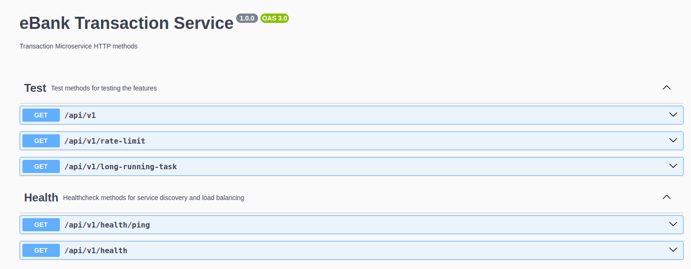

## How to launch

1. Make sure you have created **.env** file and populate it according to **.env.example**.
2. Run a production or development profile.
3. Access Service Discovery dashboard at http://localhost:5000.
4. Access Service Discovery Swagger at http://localhost:5000/api/docs.
5. Access Gateway Swagger at http://localhost:7000/api/docs.

### Production
Services have replicas and minimal ports are exposed. Containers are constrained on resources available.
1. Run `docker compose up -f compose.prod.yml -d --build` or `./start.sh prod`.

### Development
Services are not scaled in this mode, also the containers do not have resource constraints, each service exposes a port on host machine.
1. Run `docker compose up -d --build` or `./start.sh dev`.
2. Access Account Microservice Swagger at http://localhost:3000/api/docs.
3. Access Transaction Microservice Swagger at http://localhost:4000/api/docs.

## How to test
Use Swagger UI for testing HTTP for each service. Example:

For testing WS and gRPC use Postman, create a new gRPC request, in Service definition import proto file or
use server reflection. Example:

### Stats
You can see usage metrics using `docker stats` for full stats or `./stats.sh` for basic ones.

### Ports
On all services HTTP ports are mapped to 3000, gRPC to 3100, WS to 3200.